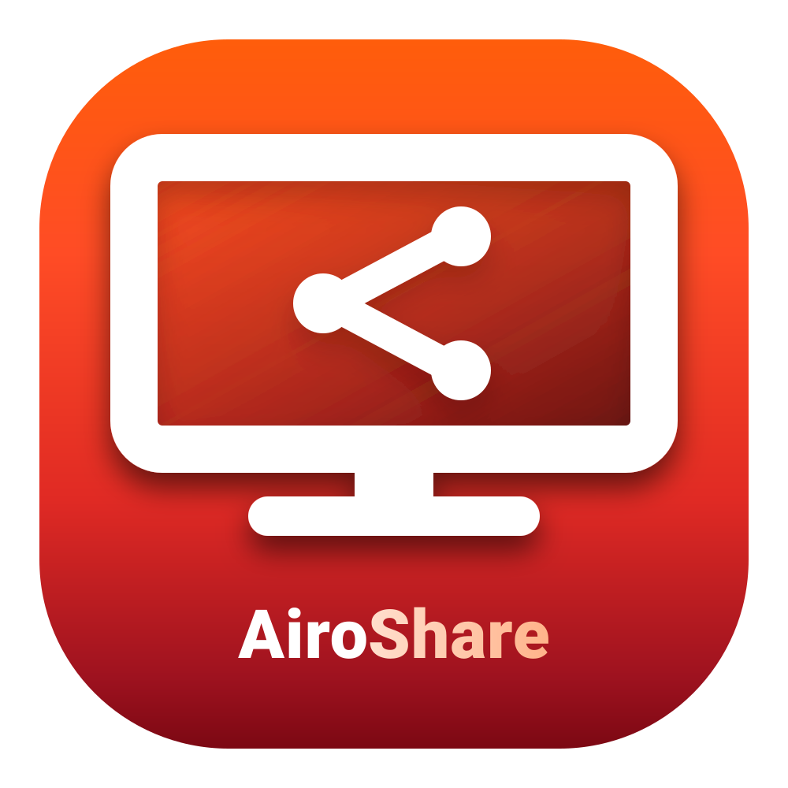
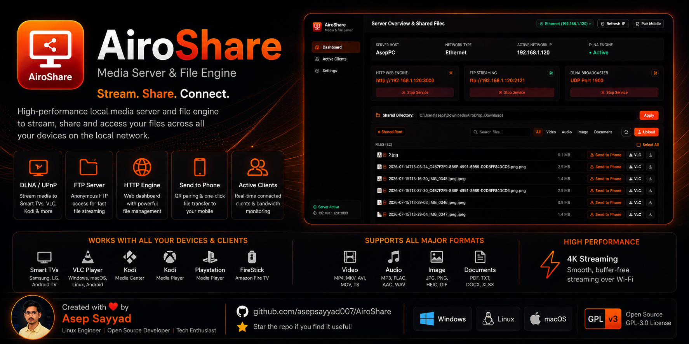

<div align="center">



# AiroShare
### High-Performance Local Media Server & File Engine
##### Built by [Asep Sayyad](https://github.com/asepsayyad007)

[](https://github.com/asepsayyad007/AiroShare)
[](#technical-deep-dive)
[](LICENSE)
[](#)

**Stream 4K videos, music, and photos from your PC to Smart TVs, VLC, smartphones, and consoles over Wi-Fi with zero lag.**

<br />



<br />

[Key Features](#key-features) • [Quick Start](#quick-start-guide) • [Supported Devices](#supported-devices--protocols) • [System Architecture](#system-architecture) • [Technical Deep Dive](#technical-deep-dive)

</div>

---

## Key Features

* **Instant DLNA Broadcasts**: Auto-discover and stream your media library to Smart TVs (Samsung Tizen, LG webOS, Android TV, FireStick), VLC, Kodi, Xbox, and PlayStation via SSDP/UPnP AV.
* **Dual-Select "Send to Phone"**: Select multiple files or folders from your PC and instantly generate a local pairing QR code for easy smartphone downloading.
* **High-Speed FTP Engine**: Built-in anonymous FTP streaming server (`ftp://<IP>:2121`) for password-free file mounting and streaming.
* **Live Service Controller**: Enable, disable, or adjust HTTP, FTP, and DLNA servers independently in real-time from the web dashboard.
* **Strict Path Isolation**: Built-in directory traversal guard to secure and restrict file browsing strictly to shared folders.
* **Active Client Monitoring**: Real-time connected client tracker displaying active streaming bandwidth, device names, and client logs.
* **VLC / Kodi Integration**: Auto-generated M3U playlist file (`/playlist.m3u`) and Plex JSON feed (`/api/plex/feed`) for instant playlist importing.
* **Sunset Palette System**: Modern, dark-mode glassmorphic user interface styled with premium micro-interactions.

---

## Supported Devices & Protocols

| Device / Client | Connection Protocol | Formats Supported |
| :--- | :--- | :--- |
| **Samsung Smart TV (Tizen)** | UPnP / DLNA Discovery | MP4, MKV, JPG, PNG |
| **LG Smart TV (webOS)** | UPnP / DLNA Discovery | MP4, MKV, JPG, PNG |
| **Android TV / FireStick** | SSDP Multicast + DLNA | MP4, MKV, TS, MP3 |
| **VLC Media Player** | UPnP / M3U Playlist / HTTP / FTP | MP4, MKV, AVI, MOV, MP3, FLAC, JPG |
| **Kodi Media Center** | UPnP / DLNA / Plex Feed | MP4, MKV, AVI, FLAC |
| **Xbox & PlayStation** | Media Player DLNA Client | MP4, MP3, JPG |

---

## Quick Start Guide

### 1. Prerequisites
Ensure you have [Node.js](https://nodejs.org/) (v18 or higher) installed on your system.

### 2. Installation
```bash
# Clone the repository
git clone https://github.com/asepsayyad007/AiroShare.git
cd AiroShare

# Install dependencies
npm install
```

### 3. Build & Launch
Build the high-performance Vite production assets and start the local server:
```bash
# Compile and start
npm run build
npm run server
```

The server will initialize and output local network credentials:
* **Web Dashboard**: `http://localhost:3000` (or local LAN IP: `http://192.168.1.120:3000`)
* **SSDP/DLNA Broadcast URL**: `http://192.168.1.120:3000/dlna/description.xml`
* **FTP Stream Port**: `ftp://192.168.1.120:2121`

---

## System Architecture

```
AiroShare/
├── config/                  # Server & DLNA configuration
├── src/                     # React Frontend & DLNA Engine
│   ├── components/          # Dashboard, ActiveClients & Settings UI
│   ├── dlna/
│   │   ├── ssdp/            # Multicast SSDP Broadcaster (UDP 1900)
│   │   ├── device/          # UPnP Device XML & Icon Handlers
│   │   ├── soap/            # SOAP Request & Response Parser
│   │   └── contentDirectory/# MediaStore & ContentDirectory Service
│   └── utils/               # Real-time Client Tracker & Stream Handler
├── server.js                # Express Server, File Engine & API Router
├── ftpServer.js             # High-Speed FTP Server Engine
└── simple_dlna.js           # Lightweight Standalone DLNA CLI Server
```

---

## Technical Deep Dive

AiroShare is built to be a robust, high-performance, and lightweight local area network (LAN) sharing system.

### Dual-Stack Dynamic Bindings
* **Dual-Stack Socket Binding**: AiroShare binds to Node's dual-stack IPv6/IPv4 listener (`:::3000`), allowing clients to connect using `http://localhost:3000`, computer network name (`http://aseppc:3000`), or direct LAN IP addresses.
* **Auto Adapter Scanning**: The network engine uses `os.networkInterfaces()` to detect active physical adapters (Wi-Fi, Ethernet) while ignoring virtual interfaces (WSL, VirtualBox, loopbacks). The client immediately sees connected connection badges (e.g. `Wi-Fi (192.168.1.120)`) in real-time.
* **Fully Dynamic Configuration**: The system hostname and IP addresses adapt dynamically on server start. If the software is installed on another machine (e.g., Ubuntu Linux, macOS, or another Windows PC), it resolves everything correctly without manual setup.

### High-Speed Streaming Mechanics
* **Express HTTP Stream Engine**: High-performance HTTP server supporting chunked file streaming with `Accept-Ranges: bytes`. This allows Smart TVs and media players to scrub/seek instantly through large 4K UHD video files.
* **SSDP Multicast Broadcaster**: Custom SSDP implementation running on UDP `239.255.255.250:1900`. It broadcasts location packets pointing to `/dlna/description.xml` to notify VLC and Smart TVs of the AiroShare media server's presence.
* **Anonymous FTP Server**: High-speed FTP engine (`ftp-srv`) mapped directly to the shared directory root. It allows zero-configuration anonymous login (`anonymous:anonymous`) for simple file access in third-party clients.
* **VLC UPnP Icon Renderer**: Generates valid 24-bit RGBA binary PNG buffers for `/icon-64.png`, `/icon-128.png`, and `/icon-256.png` so that the AiroShare Sunset icon appears next to the device name inside VLC playlist interfaces.

### Security Isolation
* **Path Containment Policy**: To prevent directory traversal security risks, the file browsing API endpoint (`/api/files/browse`) validates paths against the shared `rootDirectory` using relative path calculations. Any attempt to traverse above the shared root folder is blocked and safely restricted back to the shared root.

### Cross-Platform Linux & macOS Compatibility
* **Standard Core APIs**: Since AiroShare is fully stripped of platform-locked dependencies (like SMB native modules), it is completely cross-platform. It runs perfectly on Windows, macOS, and Linux out-of-the-box.
* **Dynamic Paths**: All paths are built using Node's `path` library. The default sharing directory resolves gracefully on Linux to `/home/<username>/Downloads`.

---

## Privacy & Compliance

AiroShare is built from the ground up to be **100% private, self-hosted, and local-only**:
* **No Cloud Connection**: All media streaming, folder browsing, and file transfers remain completely on your local computer and your private Wi-Fi network.
* **No Analytics / Telemetry**: No usage stats, server logs, or metadata are ever collected or sent to external servers.
* **Compliance by Design**: Fully compliant under the General Data Protection Regulation (GDPR), California Consumer Privacy Act (CCPA), and COPPA since no personal data is stored or processed on third-party servers.

For details, check our full [PRIVACY.md](PRIVACY.md).

## Credits

AiroShare is built on top of awesome open-source technologies:
* **Electron**: Native desktop app packaging.
* **React & Vite**: Frontend user interface.
* **Express**: HTTP file streaming & streaming endpoints.
* **ftp-srv**: Native High-Performance Node FTP Server.
* **simple-upnp-dlna**: SSDP & UPnP DLNA broadcaster.
* **Lucide React**: Modern iconography.

## License

This project is released under the **GNU General Public License v3**. Designed for high-speed local home media streaming and file sharing.

